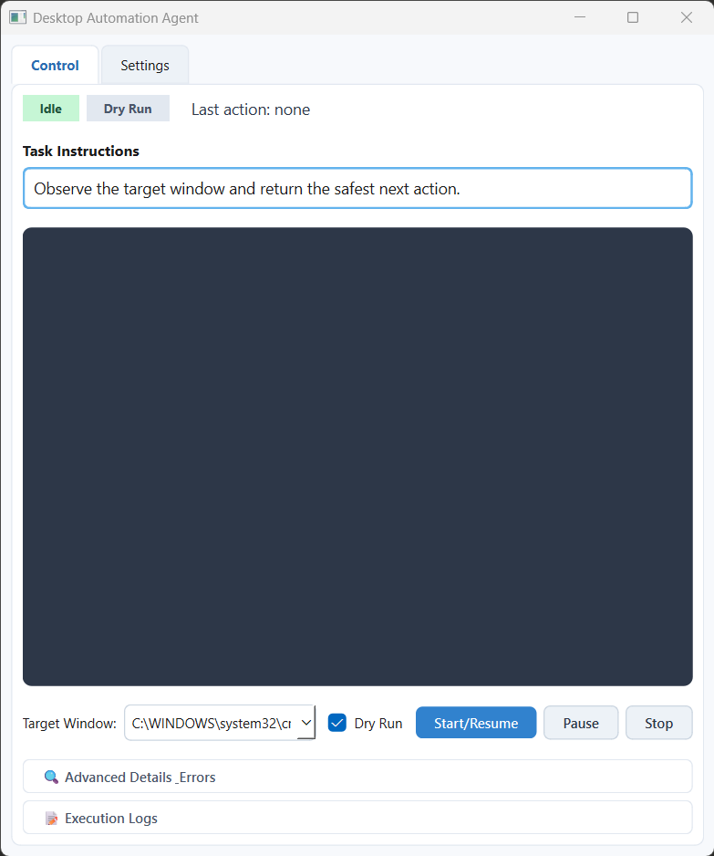
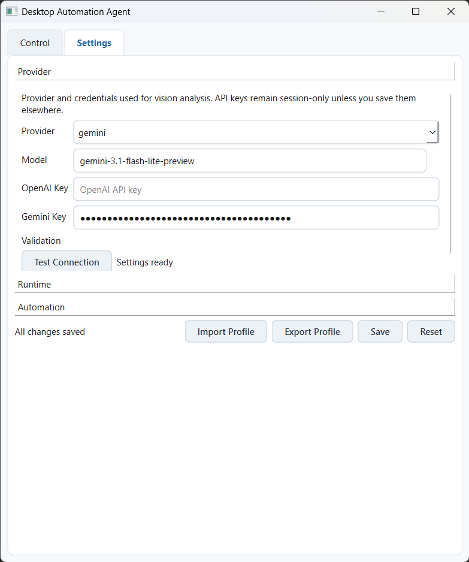

<div align="center">

# Desktop Automation Agent

**An AI-powered Windows desktop automation tool that sees your screen and acts on it.**

Give it a goal, point it at a window, and watch it work.

[](https://python.org)
[](https://doc.qt.io/qtforpython-6/)
[](#supported-providers)
[](#supported-providers)
[](#requirements)

</div>

---

## How It Works

The agent runs in a continuous loop, using vision-language models to decide what to do next:

```
                        +------------------+
                        |  Pick a Window   |
                        +--------+---------+
                                 |
                                 v
                     +-----------+-----------+
                     |  Capture Screenshot   |
                     +-----------+-----------+
                                 |
                                 v
                     +-----------+-----------+
                     | Resize & Compress for |
                     |    LLM Efficiency     |
                     +-----------+-----------+
                                 |
                                 v
                     +-----------+-----------+
                     |  Send to Gemini or    |
                     |  OpenAI for Analysis  |
                     +-----------+-----------+
                                 |
                                 v
                     +-----------+-----------+
                     | Model Returns Action  |
                     |  (click, type, drag)  |
                     +-----------+-----------+
                                 |
                        +--------+--------+
                        |                 |
                        v                 v
                  +-----------+    +-----------+
                  |  Dry Run  |    |   Live    |
                  |  (log it) |    | (do it!)  |
                  +-----------+    +-----------+
                                         |
                                         v
                              +----------+----------+
                              | Track Confidence &  |
                              | Auto-Stop on Goal   |
                              +---------------------+
```

Each cycle, the model receives the current screenshot and returns a structured JSON response with the action type, coordinates, confidence score, and reasoning. The agent validates the response, checks confidence thresholds, and either logs it (dry run) or executes it (live mode).

---

## Screenshots

### Control Tab

The main interface where you monitor and control the automation.

<div align="center">

</div>

- **Status badges** -- see the current state (`Idle`, `Running`, `Paused`) and mode (`Dry Run` / `Live`) at a glance
- **Task Instructions** -- describe what you want the agent to accomplish
- **Screenshot preview** -- live view of what the model sees each cycle
- **Collapsible details** -- expand to see confidence scores, action reasoning, errors, inferred goals, and completion trends

### Settings Tab

Configure providers, tune performance, and manage settings profiles.

<div align="center">

</div>

- **Provider selection** -- switch between Gemini and OpenAI with one click
- **API key management** -- keys are masked and stored separately in `.secrets.yaml`
- **Test Connection** -- validate your provider credentials before running
- **Runtime tuning** -- adjust confidence threshold, cycle interval, retries, backoff, and image sizing
- **Profile import/export** -- share non-secret settings across machines

---

## Features

### Vision-Driven Automation
The agent captures the target window, sends the screenshot to a vision-language model, and receives structured action decisions. No element selectors, no brittle scripts -- it works with any application the same way a human would.

### Supported Actions
| Action | Description |
|--------|-------------|
| `click` | Left-click at a specific location |
| `double_click` | Double-click at a specific location |
| `drag` | Click and drag from one point to another |
| `type_text` | Type text into the focused input |
| `press_hotkey` | Press keyboard combinations (e.g. `Ctrl+A`) |
| `wait` | Do nothing (page loading, animations) |

Coordinates use a normalized `0-1000` scale and are converted to absolute window coordinates at execution time.

### Safety First

- **Dry-run mode** -- see exactly what the model wants to do before enabling live execution
- **Confidence threshold** -- actions below the threshold are blocked automatically (default: 80%)
- **Coordinate bounds checking** -- clicks and drags are constrained to the target window area
- **Stagnation recovery** -- detects repeated actions and nudges the model toward alternatives
- **Auto-completion** -- the model tracks task progress and stops when the goal is met

### Global Hotkeys

| Hotkey | Action |
|--------|--------|
| `F8` | Start / Resume |
| `F9` | Pause |
| `F10` | Stop |

Configurable in `config.yaml` under the `hotkeys` section.

---

## Supported Providers

| Provider | Default Model | Status |
|----------|---------------|--------|
| Gemini | `gemini-3.1-flash-lite-preview` | Supported |
| OpenAI | `gpt-4.1-mini` | Supported |

Both providers support vision-based analysis. Choose your provider and model in the Settings tab or via CLI flags.

---

## Requirements

- **Windows 10 or 11**
- **Python 3.11+**
- A visible target application window (minimized windows are not supported)
- An API key for [Gemini](https://ai.google.dev/) or [OpenAI](https://platform.openai.com/)

---

## Quick Start

### 1. Install dependencies

```powershell
python -m pip install -r requirements.txt
```

### 2. Add your API key

Create a `.secrets.yaml` file in the project root:

```yaml
provider:
  openai_api_key: null
  gemini_api_key: "your-key-here"
```

### 3. Launch the app

```powershell
python main.py
```

Or use the batch launcher:

```powershell
.\launch-desktop-automation-agent.bat
```

### 4. Run your first automation

1. Pick a simple target window (Calculator, Notepad, etc.)
2. Keep **Dry Run** enabled
3. Enter a short goal like `"Type Hello World in Notepad"`
4. Click **Start/Resume** and watch the preview, reasoning, and result fields
5. Only switch to live mode after the dry-run output looks correct

### CLI Options

```powershell
python main.py --provider gemini --dry-run --window-title-regex "Calculator"
```

| Flag | Description |
|------|-------------|
| `--provider` | `gemini` or `openai` |
| `--dry-run` | Start in dry-run mode |
| `--window-title-regex` | Target window title pattern |
| `--config` | Path to config file |

---

## Configuration

### `config.yaml` -- App Settings (safe to commit)

```yaml
window:
  title_regex: "Notepad"          # Target window pattern

runtime:
  confidence_threshold: 80        # Min confidence to execute (0-100)
  dry_run: true                   # Start in dry-run mode
  cycle_interval_seconds: 1.0     # Seconds between cycles
  llm_max_width: 1024             # Screenshot resize for LLM
  llm_max_height: 1024
  llm_jpeg_quality: 70            # JPEG compression (30-95)
  max_retries: 2                  # Provider call retries
  retry_backoff_seconds: 0.5

provider:
  name: gemini
  model: gemini-3.1-flash-lite-preview

prompt:
  operator_goal: "Observe the target window..."

hotkeys:
  start: F8
  pause: F9
  stop: F10
```

### `.secrets.yaml` -- API Keys (git-ignored)

```yaml
provider:
  openai_api_key: "sk-..."
  gemini_api_key: "your-key-here"
```

---

## Project Layout

```
desktop-automation-agent/
|
+-- main.py                  # CLI entry point and app bootstrap
+-- agent.py                 # Main cycle orchestration
+-- settings.py              # Typed configuration models (Pydantic)
|
+-- actions/
|   +-- executor.py          # Action execution, coordinate translation
|
+-- capture/
|   +-- window_capture.py    # Window discovery, screenshot capture
|
+-- llm/
|   +-- client.py            # Provider adapters (OpenAI, Gemini)
|   +-- prompts.py           # System + user message construction
|   +-- response_models.py   # Decision schema (Pydantic)
|
+-- interaction/
|   +-- hotkeys.py           # Global hotkey listener
|   +-- mouse_dynamics.py    # Mouse path interpolation + jitter
|   +-- timing_engine.py     # Input timing delays
|   +-- variance_injector.py # Human-like input variance
|
+-- ui/
|   +-- main_window.py       # PySide6 main window (Control + Settings tabs)
|   +-- controller.py        # Runtime state management + scheduler
|   +-- view_models.py       # UI state data binding
|
+-- vision/
|   +-- element_detector.py  # Future vision helper seam
|
+-- config.yaml              # Default app settings
+-- .secrets.yaml             # API keys (git-ignored)
+-- requirements.txt          # Python dependencies
```

---

## Architecture

```
User clicks Start
        |
        v
  RuntimeController          manages state (idle/running/paused)
        |                    schedules cycles via Qt timer
        v
  DesktopAutomationAgent     orchestrates one capture-analyze-execute cycle
        |
   +----+----+--------+
   |         |         |
   v         v         v
Capture    LLM       Execute
   |         |         |
   v         v         v
WindowCapture  LlmClient  ActionExecutor
(PrintWindow   (Gemini/    (pydirectinput
 + mss)        OpenAI)     + pywin32)
```

The capture layer tries `PrintWindow` first and falls back to `mss` if the frame is blank. The LLM client normalizes responses across providers and validates against a strict JSON schema. The executor translates normalized coordinates to absolute window positions before injecting input.

---

## Known Limitations

- **Windows-only** -- depends on `pywin32`, `pydirectinput`, and `pynput`
- **Minimized windows** -- not supported; the target must be a visible, normal window
- **Two providers** -- UI supports Gemini and OpenAI only
- **No element detection** -- `vision/element_detector.py` is a placeholder for future work
- **Tests** -- test files exist but are empty placeholders

---

## License

This project is for personal and educational use.
